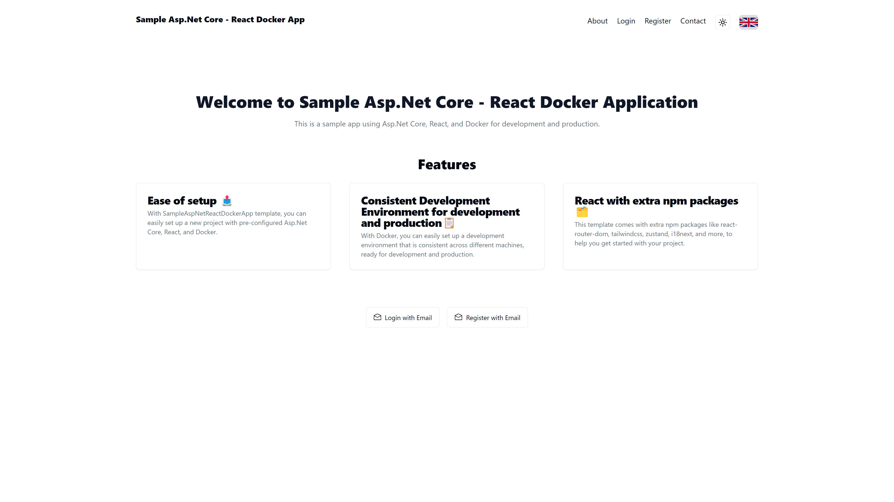
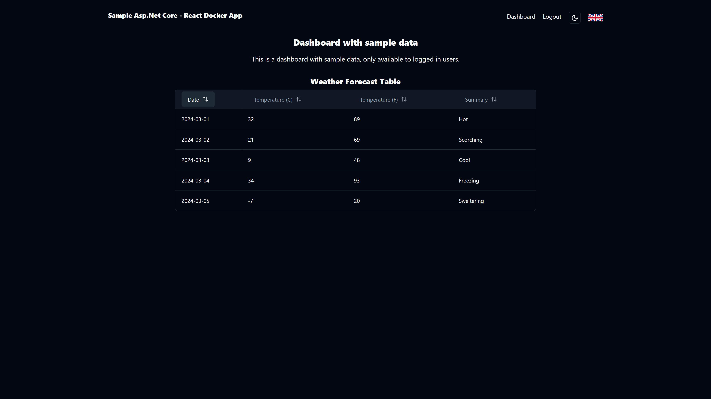

# Sample AspNet Core with React and Docker support application
    


A sample .Net 8.0 web API with React and Docker support project for demonstration purposes and as a starting point for a fullstack application. 

This project utilizes the .Net 8.0 SDK, React, and Docker to create a development and production environment for a web application, with the addition of Nginx for routing between the React and .Net applications.

I recommend using this repository as a starter project for your fullstack application, as it provides a good starting point for a .Net application with a React frontend, and it is configured to run as a collection of Docker containers, ready for development and production.

<figure>

<figcaption>Project's sequence graph</figcaption>
</figure>

<br />
<br />

<figure>

<figcaption>Project's main graph</figcaption>
</figure>

## Table of Contents

- [About the Project](#about-the-project)
- [Getting Started](#getting-started)
  - [Prerequisites](#prerequisites)
  - [Running the Application](#running-the-application)
    - [Running the Application without Docker](#running-the-application-without-docker)
    - [Running the Application with Docker](#running-the-application-with-docker)
- [Tech stack](#tech-stack)
- [Authors](#authors)
- [Screenshots](#screenshots)

## About the Project

This project is a sample .Net 8.0 web API with React and Docker support project for demonstration purposes and as a starting point for a fullstack application. The project is designed to run as a collection of Docker containers, with the .Net application running in a container, the React application running in a container (via Nginx), and a PostgreSQL database running in a container. The project also includes an Nginx to route traffic between the React and .Net applications on the same port, but different paths.

It was made to demonstrate how to create a fullstack application with .Net and React, and how to run the application in a Docker environment. The project is also a good starting point for a fullstack application, as it provides a good starting point for a .Net application with a React frontend, and it is configured to run as a collection of Docker containers, ready for development and production.

I created this project because the existing Microsoft's templates did not provide a good starting point (in my opinion) for a fullstack application with .Net and React, and I wanted to have a solid starting point for my fullstack applications, with pre-configured Docker support for production.

## Getting Started

To get started, clone the repository and open the project in Visual Studio 2022. The project is configured to run in a Docker container, so you will need to have Docker Desktop installed. Once you have the project open, you can run the project in Visual Studio 2022 and the application will start in a Docker container.

### Prerequisites

- [Visual Studio 2022](https://visualstudio.microsoft.com/vs/)
- [Docker Desktop](https://www.docker.com/products/docker-desktop)
- [Node.js](https://nodejs.org/en/)
- [React](https://reactjs.org/)
- [.Net 8.0 SDK](https://dotnet.microsoft.com/download/dotnet/8.0)

### Running the Application

You can run the application without Docker or as a collection of Docker containers. Generally, the docker-compose file was designed to run the application in a production environment, but it can also be used for development purposes.

Below are the steps to run the application in both environments:

#### Running the Application without Docker

To run the application without Docker, you can run the .Net application and the React application separately. To run the .Net application, open the project in Visual Studio 2022 and run the application. The client application should start by default, but if it does not, you can navigate to the `SampleAspNetReactDockerApp.Client` directory and run the following command:

```bash
npm install
npm run dev
```

**Create a `.env` file in the project root directory with the content of the `.env.example` file.**

**NOTE:** You will need to have Node.js installed to run the client application. The application requires connection to a PostgreSQL database, so you will need to have a PostgreSQL database running. You can configure the connection string in the `appsettings.json` file in the `SampleAspNetReactDockerApp.Server` directory, or you can set the `ASPNETCORE_CONNECTIONSTRING` environment variable to the connection string. You can also run the database in a Docker container (from docker-compose) by running the following command:

```bash
docker compose --env-file ./.env up -d app-db
```

#### Running the Application with Docker

To run the application with Docker, you can run the following command in the root directory of the project:

**Create a `.env` file in the project root directory with the content of the `.env.example` file.**

```bash
docker compose --env-file ./.env up -d
```

This will start the .Net application, the React-Vite application and the database in separate Docker containers. You can access the application at `http://localhost:8080`.

## Tech stack

- Backend
  - [.Net 8.0](https://dotnet.microsoft.com/download/dotnet/8.0) - for the server application
  - [Entity Framework Core](https://docs.microsoft.com/en-us/ef/core/) - for the database ORM
  - [PostgreSQL](https://www.postgresql.org/) - for the database
  - [Npgsql](https://www.npgsql.org/) - for the PostgreSQL database provider
  - [Swagger](https://swagger.io/) - for API documentation
  - [Microsoft Identity](https://docs.microsoft.com/en-us/aspnet/core/security/authentication/identity) - for user authentication and authorization
  - [AutoMapper](https://automapper.org/) - for object-to-object mapping
  - [FluentValidation](https://fluentvalidation.net/) - for input validation
  - [Serilog](https://serilog.net/) - for logging
- Frontend
  - [React](https://reactjs.org/) - for the client application
  - [Vite](https://vitejs.dev/) - for the client application
  - [Tailwind CSS](https://tailwindcss.com/) - for styling
  - [Zustand](https://github.com/pmndrs/zustand) - for state management
  - [Shadcn](https://shadcn.com/) - for good looking, accessible and customizable components
  - [TanStack Table](https://tanstack.com/table/latest) - for interactive and accessible tables with data
  - [React Router](https://reactrouter.com/) - for routing
  - [RadixUI](https://radix-ui.com/) - for building accessible and composable UI components, and as a foundation for Shadcn
  - [i18next](https://www.i18next.com/) - for internationalization
  - [Lucide Icons](https://lucide.netlify.app/) - for icons
  - [React World Flags](https://www.npmjs.com/package/react-world-flags) - for flags
- [Docker](https://www.docker.com/) - for containerization
- [Nginx](https://www.nginx.com/) - for routing between the React and .Net applications
- [PostgreSQL](https://www.postgresql.org/) - for the database used by the .Net application

## Authors

- **[Cyprian Gburek](https://github.com/SirCypkowskyy)**

## Screenshots

<figure>

<figcaption>Home page in English</figcaption>
</figure>

<figure>

<figcaption>Home page in Polish</figcaption>
</figure>

<figure>

<figcaption>Home page in English with light theme</figcaption>
</figure>

<figure>

<figcaption>Login page</figcaption>
</figure>

<figure>

<figcaption>Dashboard page with table (weather forecast, secured by auth)</figcaption>
</figure>

<figure>

<figcaption>Dashboard page with selected item from table</figcaption>
</figure>
